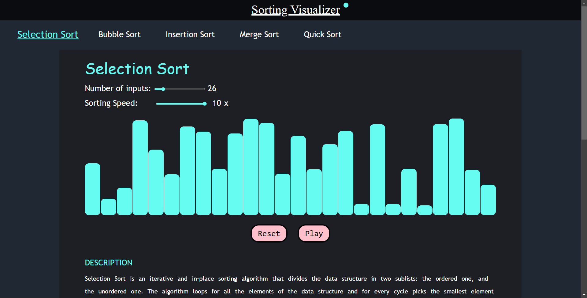
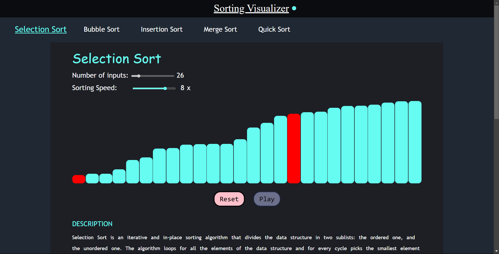
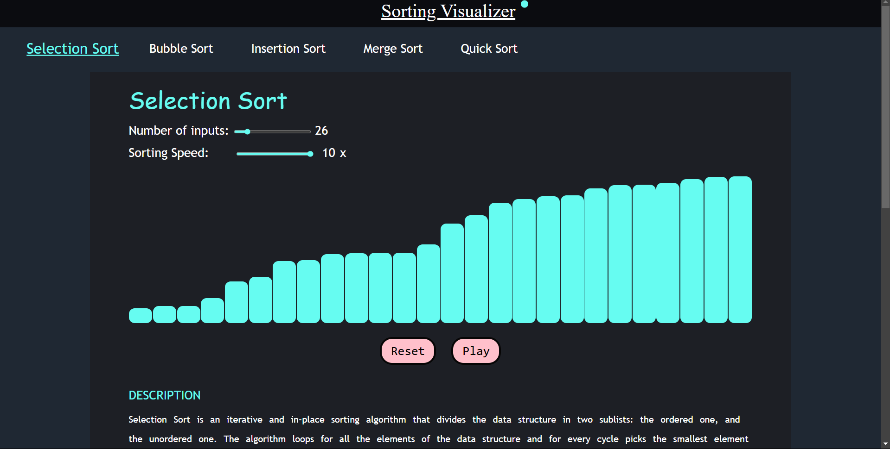
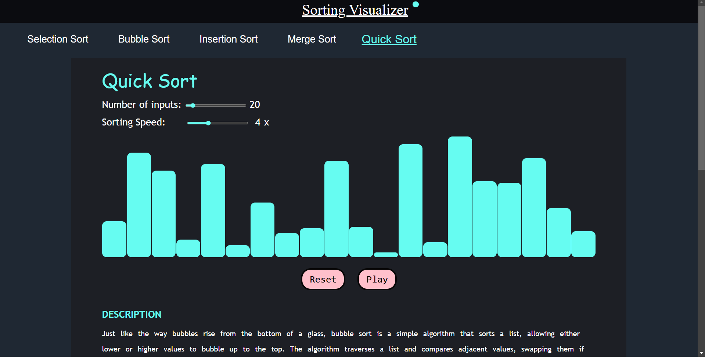
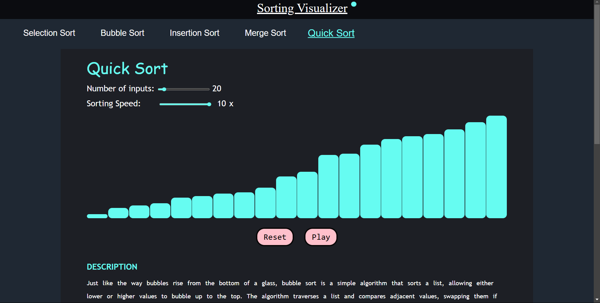
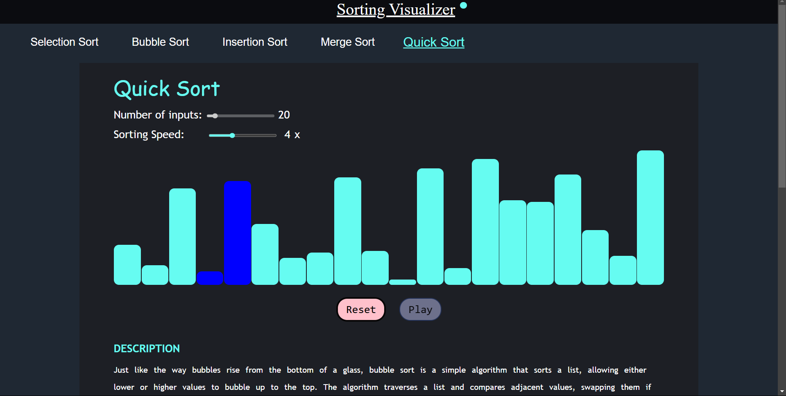
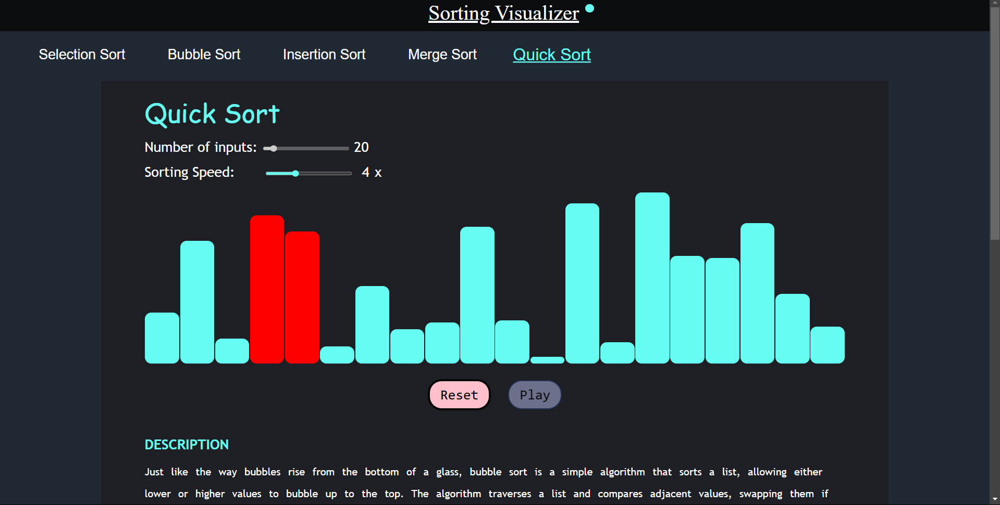

# DSA Sorting Visualizer📊
A web-based tool designed to help users **visualize** and understand various **sorting algorithms**. This project implements different sorting techniques like **Bubble Sort**, **Insertion Sort**, **Merge Sort**, **Quick Sort**, and more, using HTML, CSS, and JavaScript.
 
 
**Please visit my website**: https://amritansh-sorting-visualizer.netlify.app/

## Some Key Insights

